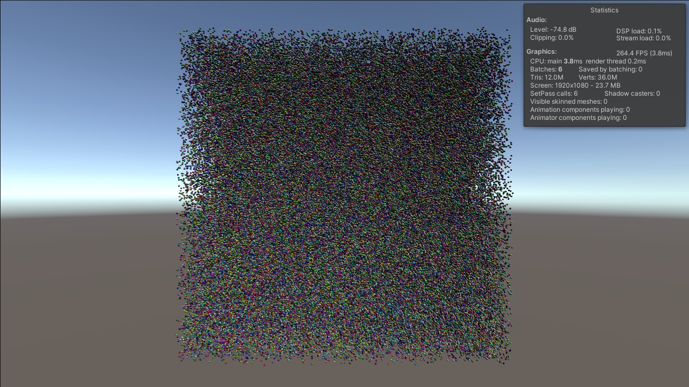
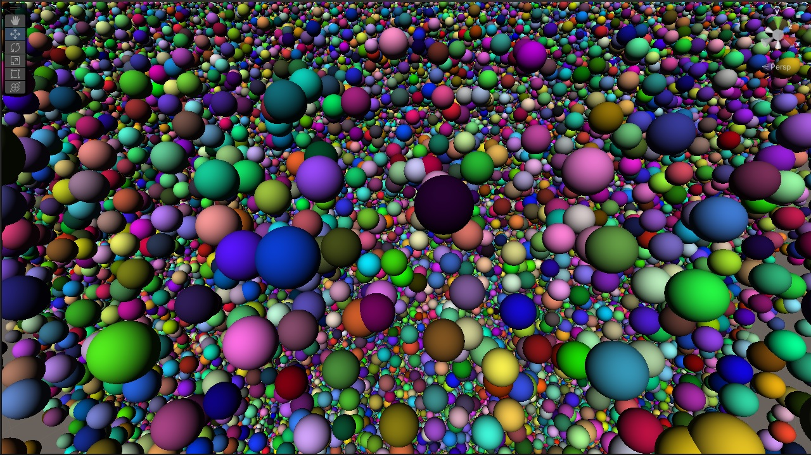

# Unity: Million Spheres

Author: Przemyslaw Zaworski
 
Licence: MIT https://mit-license.org/

Usage: File -> Open Project. Then open the scene MillionSpheres. Play.

Demo presents efficient rendering of million animated spheres. Average performance on RTX 2070 is about 250 FPS. 

To achieve this effect I combined standard rasterization with GPU based raycasting. 

For simplicity purposes, spheres use simple diffuse lighting, without casting or receiving shadows.

C# script and shader have only 110 lines of code in total.

